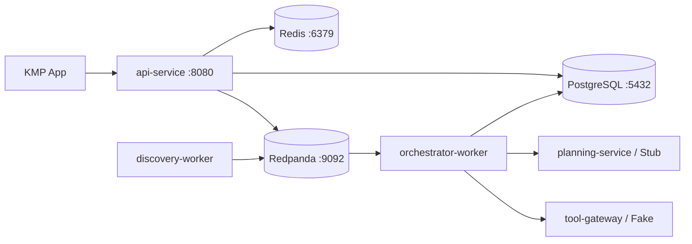

# Orbit 后端与 AI 基建搭建方案

## 目标与原则

目标是在本地跑通一条可恢复的任务闭环：**创建任务 → 查询候选 → 生成 A/B/C 方案 → 审批 → 创建提醒 → 查看任务事件**。设计保留生产级服务边界，但第一阶段只部署少量进程。

原则：PostgreSQL 是状态权威；耗时操作全部异步；AI 只输出结构化建议；所有外部写操作必须审批、审计和幂等；跨模块只依赖稳定契约。

## 一、目标目录与 Gradle 模块

从现有 `backend` 与 `ai` 平滑拆为下列模块。先仍在一个 Git 仓库和一个 Gradle build 中，所有运行模块都可以单独构建镜像和启动。

```text
contracts/
  api/                         # HTTP DTO、错误码、分页与 Problem JSON
  events/                      # TaskCreated、PlanReady、ApprovalDecided 等事件
  schemas/                     # JSON Schema / 未来的 Protobuf 定义

backend/
  api-service/                 # Ktor：REST、SSE、鉴权、限流
  task-domain/                 # 任务状态机、审批策略、命令 Use Case
  task-persistence/            # Exposed/jOOQ、Flyway、Outbox repository
  orchestrator-worker/         # 消费事件、状态推进、重试与恢复
  tool-gateway/                # 工具接口、Stub/真实连接器、第三方 OAuth
  discovery-worker/            # 定时发现、去重、过期处理
  observability/               # OTel、结构化日志、审计事件

ai/
  planning-core/               # PlanningContext、PlanProposal、模型无关接口
  planning-service/            # Provider 路由、Prompt、structured output
  policy-engine/               # Schema/规则/注入防护/成本预算
  evaluation/                  # 固定评测集与离线回放
```

依赖方向：`api-service → task-domain → task-persistence`；`orchestrator-worker → task-domain + planning-core + tool-gateway`；`planning-service → planning-core + policy-engine`；所有模块都可依赖 `contracts`。反向依赖、跨服务直接访问数据库、AI 直接依赖 tool gateway 均禁止。

## 二、本地最小部署拓扑



Docker Compose 启动 PostgreSQL、Redis、Redpanda、Keycloak 和 OpenTelemetry Collector。开发时 `api-service`、worker、AI 可由 Gradle 在宿主机启动，便于断点调试；CI 和 staging 用同一份 Dockerfile 分别构建这些运行入口。

第一阶段连接器均为可预测的 Fake：`SportsCatalog`、`MovieCatalog`、`Calendar`、`Notification`。Fake 的返回值要包含时效、来源、延迟和可注入失败，确保恢复、重试和审批可以测试，而不是只展示正常路径。

## 三、基础设施清单

| 组件 | 第一阶段用途 | 生产演进 |
| --- | --- | --- |
| PostgreSQL | 任务、审批、事件、Outbox、偏好；Flyway 迁移 | 托管高可用、读副本、按时间归档 task_event |
| Redpanda | Kafka 兼容任务事件、重试主题、DLQ | 托管 Kafka/多副本，Schema Registry |
| Redis | API 限流、短期缓存、SSE 连接辅助；非权威 | Redis Cluster |
| Keycloak | 本地 OIDC、测试用户与 JWT | 企业 IdP/Auth0/Cognito，无业务改动 |
| OTel Collector | Trace、metrics、logs 接收 | Tempo/Jaeger + Prometheus/Grafana + 日志平台 |
| MinIO（第二阶段） | 工具原始响应/附件的对象存储 | S3/GCS，生命周期与加密策略 |

所有配置通过环境变量注入并提供 `.env.example`；密码、OAuth client secret、模型密钥不进 Git。生产使用 Secret Manager/Vault，服务使用短期 workload identity。

## 四、数据表与迁移顺序

Flyway 使用 `V001__task_core.sql` 等向前兼容迁移；禁止修改已经上线的 migration。

1. `tasks`：`id, tenant_id, owner_user_id, status, version, request_text, timezone, lease_until, created_at, updated_at`。
2. `task_conditions`：`id, task_id, type, value_json, source, is_hard, created_at`。
3. `plan_options`、`plan_steps`：保存通过校验的 Plan A/B/C、来源与有效期。
4. `approvals`、`approval_actions`：审批快照、版本、动作 payload、风险级别。
5. `external_actions`：`id, task_id, action_type, idempotency_key, status, external_ref, retry_count`。
6. `task_events`：不可变时间线，`task_id + sequence` 唯一。
7. `outbox_events`、`processed_events`：可靠发布与消费者去重。
8. `discoveries`、`feedback`、`preferences`：主动发现与透明画像。

所有用户数据表都含 `tenant_id`；核心索引至少包含 `(tenant_id, owner_user_id, updated_at desc)`、`(task_id, sequence)`、`(status, lease_until)`。金额使用 `amount_minor + currency`，时间使用 UTC 加 IANA timezone。

## 五、事件、队列和状态机

### Topic 与消费者

| Topic | 生产者 | 消费者 | 用途 |
| --- | --- | --- | --- |
| `orbit.task-events.v1` | task-domain | orchestrator、query projection | 创建、条件更新、审批、取消 |
| `orbit.execution-events.v1` | orchestrator/tool-gateway | task-domain、通知 | 动作成功/失败/重试 |
| `orbit.discovery-events.v1` | discovery-worker | task-domain/通知 | 新机会可用 |
| `orbit.dlq.v1` | 任意 consumer | 运维重放工具 | 超过重试预算的事件 |

分区 key 为 `taskId`，保证同一任务事件有序；消费者假定“至少一次”，以 `eventId` 去重。失败执行指数退避并进入 retry topic，超过上限才进入 DLQ。

### Worker 实现方式

Worker 消费 `TaskCreated` 后，先以 `tasks.version` 和 `lease_until` 原子领取任务，才能调用工具或模型。每个可恢复阶段完成后持久化状态、事件和 outbox，再推进下一阶段。进程故障时，定时 reclaim job 领取过期 lease 的任务。

状态：`QUEUED → GATHERING_CONTEXT → PLANNING → VALIDATING → AWAITING_USER → EXECUTING → COMPLETED`，另有 `RETRY_SCHEDULED`、`FAILED`、`CANCELLED`。状态转换由 task-domain 单点校验，不能散落在 HTTP controller 或 AI prompt 中。

## 六、首条任务链路的实现拆分

### 6.1 创建与规划

1. `POST /v1/tasks`：API 校验 JWT、请求体与 `Idempotency-Key`，调用 `CreateTaskUseCase`。
2. 同一数据库事务写入 `tasks(QUEUED)`、初始条件、`TaskCreated` 审计事件和 `outbox_events`；返回 `202`。
3. Outbox publisher 发布 `orbit.task-events.v1`；worker 领取任务，调用只读 Sports/Movie/Calendar Fake。
4. worker 构造脱敏且有大小上限的 `PlanningContext`，调用 `planning-service`。
5. `policy-engine` 校验 JSON schema、预算、时间冲突、来源新鲜度；成功后写 `plan_options` 与 `PlanReady`，状态转 `AWAITING_USER`。
6. App 经 SSE `GET /v1/tasks/{id}/stream` 或详情轮询看到 Plan A/B/C。

### 6.2 审批与外部动作

1. App 提交 `POST /v1/approvals/{approvalId}/decision`，带 `expectedVersion` 和被用户编辑后的动作列表。
2. task-domain 校验 owner/tenant、审批状态、动作 schema 和风险策略；批准后写入 `external_actions(PENDING)` 与 outbox，返回 `202`。
3. worker 以稳定 `idempotencyKey` 调用 Calendar/Notification；每个动作独立落结果。
4. 全部成功为 `COMPLETED`；部分失败显示部分成功并进入可重试状态。每一步写 task event，App 可恢复展示。

## 七、接口与鉴权落地顺序

第一批接口：

```text
GET  /health/live                 # 进程存活
GET  /health/ready                # DB、broker、依赖就绪
POST /v1/tasks                    # 需 scope orbit.tasks.write，202
GET  /v1/tasks                    # 需 scope orbit.tasks.read，cursor 分页
GET  /v1/tasks/{taskId}
GET  /v1/tasks/{taskId}/stream    # SSE，支持 Last-Event-ID
POST /v1/approvals/{approvalId}/decision
POST /v1/tasks/{taskId}/cancel
```

Ktor 使用 OIDC JWT 验签中间件；Controller 将 `sub/tenant_id/scopes` 转成 `ActorContext` 后传给 Use Case。每条查询都强制传 `ActorContext`，Repository 在 SQL 条件中约束 `tenant_id` 和数据 owner。测试覆盖“同租户其他用户”和“跨租户”均无法读取或批准任务。

## 八、AI 的第一阶段实现

先提供两个 `ModelProvider`：

- `DeterministicStubProvider`：基于固定候选返回完全确定的 JSON，作为本地 Demo、集成测试和回归基线。
- `RemoteModelProvider`：仅通过环境变量配置，调用真实模型；输出经过 JSON schema 验证和 repair 一次后仍失败即降级，不向用户暴露半结构化模型文本。

每次调用写 `ai_invocations`/Trace 属性：任务 ID、provider、模型、prompt 版本、延迟、输入/输出 token、成本、校验结果；原文按脱敏和保留策略进入对象存储，而不是应用日志。并发、token、工具次数和总耗时均受 `TaskBudget` 限制。

## 九、测试、CI 与验收

| 层级 | 工具/内容 | 首批验收 |
| --- | --- | --- |
| Unit | Kotlin/JUnit、状态机与 policy | 非法状态转移、预算超限、越权批准均失败 |
| Integration | Testcontainers：Postgres、Redpanda、Redis、Keycloak | 创建事件最终生成方案；重复事件不重复写动作 |
| Contract | JSON Schema/OpenAPI、消费者测试 | API/事件向后兼容 |
| E2E | KMP 或 HTTP scenario | 创建→方案→批准→提醒→时间线完整可见 |
| Resilience | 注入模型超时、broker 重投、worker 崩溃 | 恢复后无重复日历项，任务可解释 |
| AI eval | 固定 50 条任务集 | 结构化有效率、硬约束满足率、审批拦截率可追踪 |

CI 顺序：format/lint → unit → Testcontainers integration → contract check → 构建容器镜像 → staging smoke test。数据库 migration、API schema 与事件 schema 都作为发布检查项。

## 十、推荐实施节奏

| 阶段 | 产出 | 完成标准 |
| --- | --- | --- |
| A：工程骨架 | 子模块、Compose 基础设施、Keycloak、健康检查、配置 | 一条命令启动依赖，服务 readiness 正确 |
| B：任务核心 | Flyway、Task 状态机、Outbox、任务 REST API | 可创建、查询、取消任务；幂等与租约测试通过 |
| C：异步规划 | Redpanda、worker、Fake Tools、Stub AI、SSE | 任务最终给出 A/B/C，worker 重启可恢复 |
| D：审批执行 | Approval、External Action、Calendar/Notification Fake | 重复批准不重复创建；部分成功可重试 |
| E：生产护栏 | OIDC、OTel、DLQ、限流、成本与安全 policy | 可从 trace 追到每个 action，故障可告警 |
| F：真实集成 | 真实模型、内容源、OAuth 连接器、discoveries | 灰度开启，有回放/评测/降级能力 |

**建议现在从阶段 A + B 开始**；但在阶段 B 结束前，绝不接真实模型或真实日历写入，先证明状态机、事件、幂等和鉴权正确。
