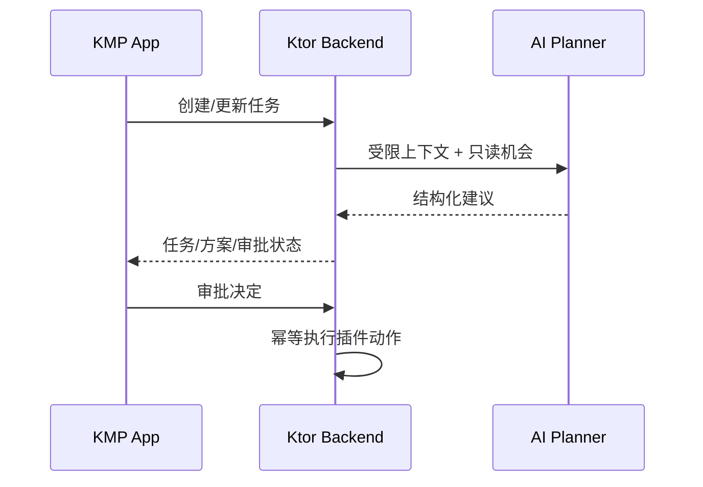
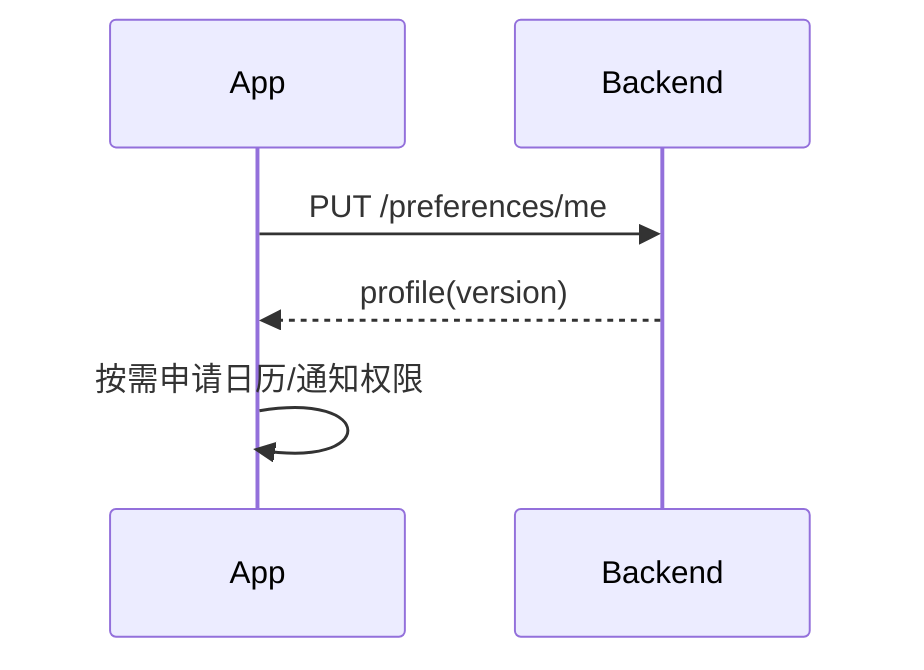
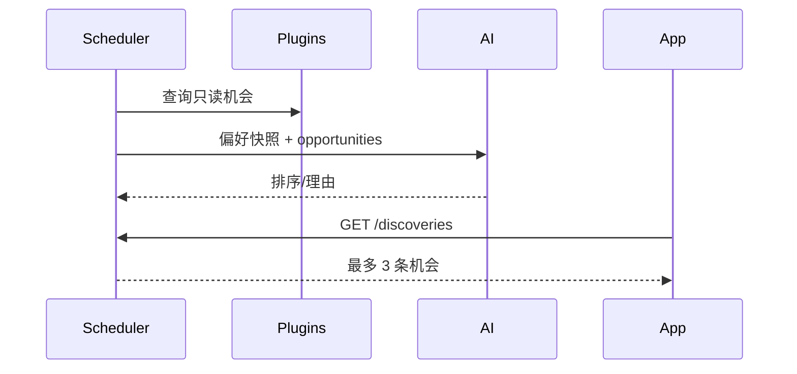
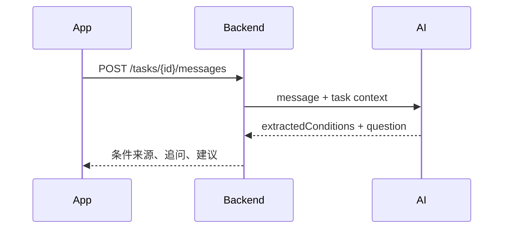
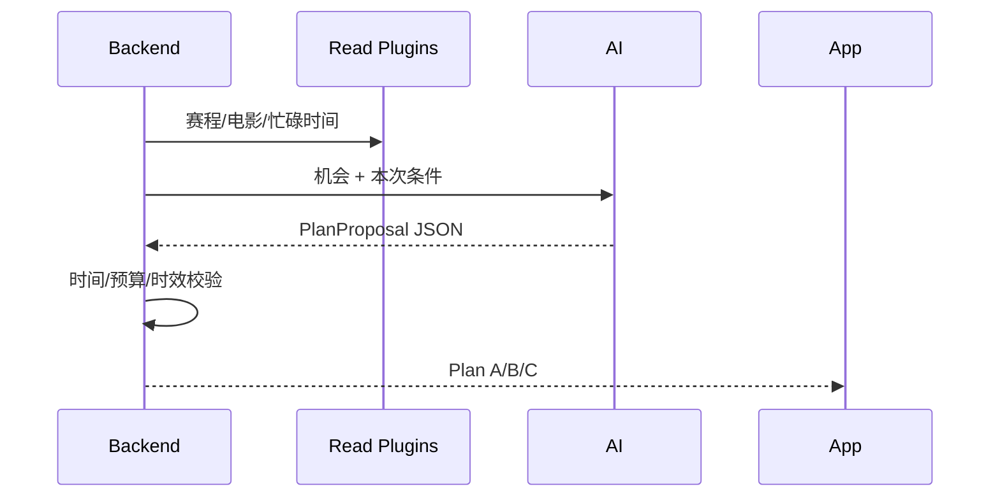
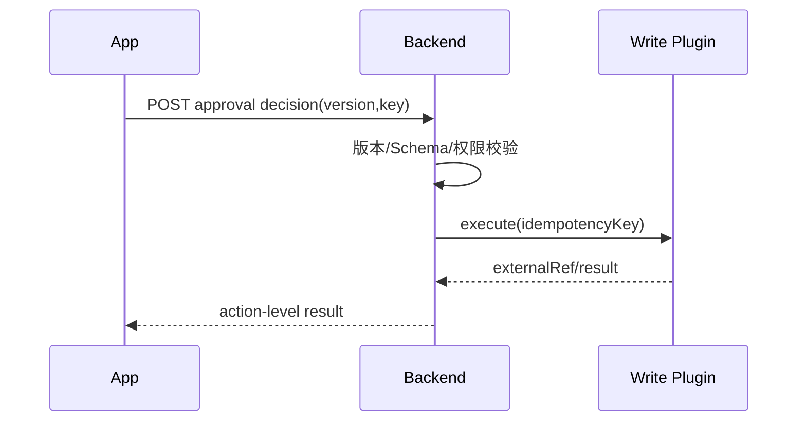

# Orbit 模块化技术方案

> 部署拓扑、事件驱动、并发一致性、AI 隔离和高并发演进标准见 [scalable-backend-ai-architecture.md](scalable-backend-ai-architecture.md)。本文件保留产品模块从 App 到后端/AI 的交互设计。

## 概览

KMP App 是交互、缓存和平台能力终端；Ktor Backend 是任务、审批、幂等与审计权威；Kotlin AI 模块只产生结构化建议，不能执行写操作。

## M1 引导与授权

App：引导草稿、系统权限、SQLDelight 缓存。后端：版本化偏好和授权元数据。AI：不调用。

取舍：权限延迟请求；未授权也允许规划，但标记日历冲突未校验。

接口：`PUT /v1/preferences/me`，字段 `interests[]`、`budget.amountMinor`、`maxCommuteMinutes`、`surpriseFrequency`、`expectedVersion`；返回 `version`、`updatedAt`。冲突：`409 PREFERENCE_VERSION_CONFLICT`。

## M2 首页与主动机会

App：待处理、每日邀约、机会卡与负反馈。后端：每周/每天限频、来源时效、去重。AI：排序与理由，不能创建任务。

接口：`GET /v1/discoveries` 返回 `id,title,domain,timeRange,cost,reason[],source,freshUntil`；`POST /{id}/dismiss` body `mode=HIDE|LESS_LIKE_THIS`；`POST /{id}/create-task`。

注意：没有高质量机会必须空状态；不能为了活跃度凑推荐。

## M3 聊天与本次条件

App：条件可编辑/删除/清空，建议需点击采纳。后端：保存 task context 与条件来源。AI：提取约束、只追问缺失关键项。

接口字段：`messageText`；返回 `conditions[{id,type,value,source=USER|SUGGESTION}]`、`question`、`quickReplies[]`、`canGenerate`。条件更新：`PATCH /tasks/{id}/conditions/{conditionId}`。

注意：长期偏好不能静默变成本次硬约束；清空后重新计算生成门槛。

## M4 画像与长期偏好

App 展示偏好、证据、删除和授权；后端保存反馈证据与偏好版本；AI 只读取已确认偏好。

接口：`GET /profile/insights` 返回 `inference, evidenceCount, confidence`；`DELETE /profile/insights/{id}`；`POST /profile/suggestions/{id}/accept`。

取舍：首版用透明权重，不训练模型；证据不足时只给建议。

## M5 方案生成与比较

App：比较、收藏、换方向。后端：确定性校验、来源与数据时效。AI：组合候选，不决定执行。

`GET /tasks/{id}` 返回 `planOptions[{id,kind,title,timeRange,location,cost,commute,reasons[],sources[],freshUntil,actions[]}]`；`POST /tasks` 可带 `regenerationHint`。

注意：模型候选违反硬约束必须丢弃；过期方案不可审批。

## M6 审批与执行

App：编辑动作、批准/拒绝/稍后、结果页。后端：审批版本、Action 表、幂等键。AI：不参与。

接口：`POST /tasks/{id}/approvals`；`POST /approvals/{id}/decision`，字段 `decision,version,actions[{id,enabled,payload}]`；返回 `taskStatus,actions[{status,externalReference,errorCode,retryable}]`。

注意：重复批准返回首次结果；Calendar 成功、提醒失败必须展示部分成功。

## M7 任务与恢复

App：待处理/进行中/完成分组、时间线、离线缓存。后端：Postgres 状态机、Redis 领取锁、重试 Worker。AI：无。

接口：`GET /tasks?status=&cursor=`、`GET /tasks/{id}/events?afterSequence=`、`POST /actions/{id}/retry`。事件字段：`sequence,type,summary,occurredAt,visibility`。

取舍：MVP 轮询；后续 WebSocket/SSE。正确性依赖 DB 乐观锁，不依赖 Redis。

## M8 反馈学习

App：结果后快捷反馈。后端：记录 feedback，更新透明排序信号。AI：可读取聚合信号，不能自行写画像。

接口：`POST /tasks/{id}/feedback`，字段 `type=SATISFIED|LESS_COMMUTE|DISLIKE, note?`；返回 `recordedAt, profileSuggestion?`。

## 跨模块数据与约束

核心表：`tasks, task_conditions, plan_options, approvals, actions, task_events, preferences, feedback, discoveries`。

所有写请求携带 `Idempotency-Key`；时间使用 UTC + IANA timezone；金额用 `amountMinor/currency`；错误统一 `code,message,requestId,details[]`。

部署：Docker Compose 起步（Ktor、Postgres、Redis），OpenTelemetry 记录任务/插件/模型 Trace；模型 Provider 通过接口抽象，Stub Provider 保证本地 Demo 可运行。
