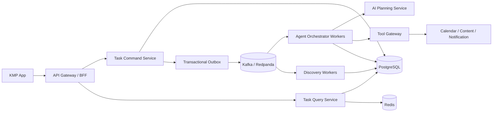
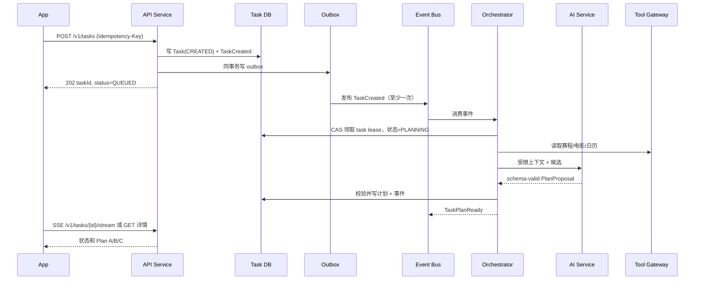
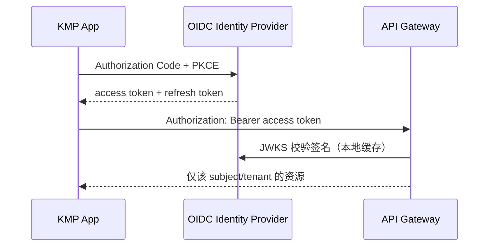

# Orbit 后端与 AI：高并发、多人协作架构

## 1. 设计结论

采用 **领域拆分的服务化架构 + 事件驱动的异步执行**。每个领域有清晰的数据所有权和 API/事件契约；本地开发以少量进程运行，生产可按负载独立横向扩容。

具体工程拆分、基础设施、实现顺序与验收标准见 [backend-ai-bootstrap-plan.md](backend-ai-bootstrap-plan.md)。

不要把 AI 放进 API 请求同步链路，也不要让模型直接拥有数据库或第三方写权限。API 层负责接收命令和读取状态；Worker 负责编排、工具调用与重试；AI 只生成经过 schema 约束的结构化决策。



### 第一阶段部署单元

| 单元 | 职责 | 可独立扩容的原因 |
| --- | --- | --- |
| `api-service` | 鉴权、命令提交、查询、SSE | 连接数与读流量高 |
| `orchestrator-worker` | 状态推进、规划、审批后的执行、重试 | 任务吞吐与模型/工具延迟高 |
| `discovery-worker` | 拉取机会、去重、排序、生成每日发现 | 周期性批任务，与用户请求隔离 |
| `tool-gateway` | 第三方连接器、限流、幂等、凭证隔离 | 外部 API 不稳定且有单独配额 |
| `ai-planning-service` | Provider 路由、结构化输出、护栏、成本控制 | LLM 吞吐、模型策略独立演进 |

本地可以先启动 `api-service`、一个通用 worker、Postgres、Redis、Redpanda；模块间仍只通过接口和事件契约通信。生产中再将上表的 worker/service 分别部署。

## 2. 代码目录与依赖规则

```text
contracts/                 # 唯一跨服务共享：API DTO、事件、错误码、schema
backend/
  api-service/             # Ktor HTTP/SSE，不能调用模型和第三方写操作
  task-domain/             # 任务、审批、计划、状态机；拥有核心写模型
  query-service/           # 列表/详情投影，可独立读扩展
  orchestrator-worker/     # 消费事件，推进状态机
  discovery-worker/        # 机会抓取与候选生成
  tool-gateway/            # MCP/连接器适配、凭证和速率限制
  persistence/             # PostgreSQL、Outbox、迁移
ai/
  planning-service/        # 模型 Provider、prompt、structured output
  policy-engine/           # 风险分级、注入防护、预算与输出验证
  evaluation/              # 离线评测集、回放与指标
```

规则：

- `contracts` 只能包含稳定 DTO、事件 schema 与错误码，不能依赖 Ktor、数据库或具体模型 SDK。
- 领域服务不读取其他服务的表；跨领域使用 API、事件或独立的读模型。
- `api-service` 写入命令后只等待持久化完成，耗时操作必须异步。
- AI 模块只能返回 `PlanProposal` 等结构化对象；执行权只在 orchestrator/tool gateway。
- 初期 Gradle 可保留这些为多模块单仓库；构建产物和运行入口分别独立，后续无需重排代码。

## 3. 关键任务链路



返回 `202 Accepted` 是刻意设计：计划生成、外部查询与模型调用无法满足普通 HTTP 同步响应的可靠性与 P95 延迟要求。App 使用 SSE 更新，也可在后台退化为轮询。

## 4. 一致性、并发与恢复

### 权威状态

- PostgreSQL 是任务、审批、动作、审计的唯一权威来源；Redis 只用于缓存、限流、短 lease。
- `tasks.version` 使用乐观锁；批准、取消、编辑条件均携带 `expectedVersion`。
- 每个外部写 Action 有稳定 `actionId` 与 `idempotencyKey`；重投、重复点击和事件重复消费只会得到同一结果。
- 使用 **Transactional Outbox**：业务写入与待发布事件同事务提交；发布器可重复投递，消费者去重。
- Worker 获取 task lease（数据库 compare-and-set + 过期时间）。机器崩溃后 lease 超时，新 Worker 从最后一个已持久化 checkpoint 恢复。

### 任务状态机

`QUEUED → GATHERING_CONTEXT → PLANNING → VALIDATING → AWAITING_USER → EXECUTING → COMPLETED`

可转入 `RETRY_SCHEDULED`、`FAILED`、`CANCELLED`。只有 orchestrator 可以迁移运行态；用户只可提交“批准/拒绝/取消”等命令。每次迁移产生不可变 `task_event`，供详情时间线、审计与重放使用。

### 事件信封

所有 broker 消息使用统一信封并做版本演进：

```json
{
  "eventId": "uuid",
  "eventType": "orbit.task.plan-ready.v1",
  "occurredAt": "2026-08-07T08:00:00Z",
  "producer": "orchestrator-worker",
  "aggregateId": "task_uuid",
  "aggregateVersion": 8,
  "traceId": "w3c-trace-id",
  "payload": {}
}
```

消费者按 `eventId` 去重；只新增可选字段，不修改既有字段语义。生产使用 Schema Registry（Avro/Protobuf 或 versioned JSON Schema）。

## 5. 数据与存储边界

| 数据 | 所有者 | 存储与扩展方式 |
| --- | --- | --- |
| Task、Plan、Approval、Action、Event | task-domain | PostgreSQL，按 `user_id`/时间建索引；读副本承接详情/历史 |
| Discovery、机会来源 | discovery-worker | PostgreSQL，按区域/时间分区；过期数据归档对象存储 |
| 用户偏好与授权元数据 | profile-domain（初期 task-domain 内模块） | PostgreSQL，版本化、软删除、审计 |
| 会话/缓存/限流 | api-service | Redis Cluster，非权威 |
| Trace、日志、评测与原始工具响应 | observability | OpenTelemetry + 对象存储/日志平台，设置保留期与脱敏 |

初期一个 Postgres 集群可使用不同 schema；每个逻辑服务仅允许访问自己 schema。流量或组织增长后，把 schema 迁移到独立数据库，不改变公开 API/事件。

## 6. AI 服务的生产边界

### 输入输出

AI Planning Service 接受的是已脱敏、带大小上限的 `PlanningContext`，输出只能是 JSON Schema 校验过的 `PlanProposal`：候选方案、理由、引用来源、待确认问题和风险标签。它没有数据库凭证、用户 OAuth token，也没有写工具。

Orchestrator 必须二次执行：JSON schema 校验、预算/时间/新鲜度/授权规则校验、来源引用存在性检查、风险策略判断。任一失败则回退为追问或失败事件，绝不直接执行。

### Provider abstraction

`ModelProvider` 统一提供 `plan(context)`、`extractConditions(message)`、`rankDiscoveries(candidates)`；路由层按任务类型、延迟预算、成本预算、灰度策略选择模型。每次调用记录 provider、model、promptVersion、token/cost、延迟、结构化校验结果，但不记录未经脱敏的敏感正文。

### 安全与成本

- 工具结果、网页文本和用户输入都当作不可信数据，不允许改变 system policy 或要求执行写动作。
- 单任务设置 token、工具次数、墙钟时间和重试预算；达到预算转为可解释失败。
- 各模型 Provider 设 circuit breaker、并发舱壁和降级路线（更小模型/规则排序/稍后重试）。
- 提示词、policy 和评测集版本化；每次发布先做离线回放和小流量 canary。

## 7. 对外 API 基线

统一路径 `/v1`，Bearer JWT/OIDC，所有响应带 `requestId`，写操作要求 `Idempotency-Key`。长任务返回 `202`。

| API | 关键请求字段 | 返回 / 语义 |
| --- | --- | --- |
| `POST /v1/tasks` | `requestText`, `timezone`, `sourceDiscoveryId?`, `constraints?` | `202 {taskId,status,version,streamUrl}` |
| `GET /v1/tasks/{taskId}` | — | `task, conditions, planOptions, approval, actions, version` |
| `GET /v1/tasks/{taskId}/stream` | `Last-Event-ID?` | SSE：`task.updated`、`plan.ready`、`approval.required` |
| `POST /v1/tasks/{taskId}/messages` | `text`, `expectedVersion` | `202 {taskId,status,version}` |
| `PATCH /v1/tasks/{taskId}/conditions/{id}` | `value`, `expectedVersion` | `200 {condition, taskVersion}` |
| `POST /v1/approvals/{approvalId}/decision` | `decision`, `expectedVersion`, `actions[]` | `202 {taskId,status,version}` |
| `POST /v1/tasks/{taskId}/cancel` | `expectedVersion`, `reason?` | `202 {taskId,status,version}` |

统一冲突响应：`409 {code: "TASK_VERSION_CONFLICT", requestId, currentVersion}`；验证失败：`422 {code, details:[{field,reason}]}`；限流：`429` 并含 `Retry-After`。

## 8. 身份认证、授权与凭证管理

### 用户登录（Authentication）

采用标准 **OIDC Authorization Code + PKCE**。KMP App 不保存用户密码：它经系统浏览器/安全 WebView 跳转到 Identity Provider（初期可选 Keycloak，生产可选 Auth0、Cognito 或企业 IdP），获得短期 access token 与可轮换 refresh token。Android 侧使用系统安全存储保存 token，绝不把 token 放入普通数据库或日志。



Access token 建议 10–15 分钟有效；refresh token 轮换、可撤销。API Gateway 校验 issuer、audience、签名、过期时间、`sub`、`tenant_id` 和 scopes；不能只解码 JWT 而不验签。

### 资源授权（Authorization）

每个领域请求都从认证上下文取出 `subjectId` 与 `tenantId`，**绝不信任客户端 body/query 中的 userId**。Task、Profile、Approval、Action、Discovery 都带 `tenant_id` 与 `owner_user_id`，查询和更新强制附带该范围；生产数据库启用 PostgreSQL Row-Level Security 作为第二道隔离防线。

| 场景 | 权限模型 |
| --- | --- |
| 个人版 | owner-only：仅任务创建者可读/改/批准/取消 |
| 家庭/团队版 | tenant RBAC：`member`、`planner`、`approver`、`admin` |
| 敏感外部动作 | RBAC + action policy：例如创建日历仅 owner，团队共享日程需 `approver` |
| 后台服务 | service identity + 最小 scope，不可模拟用户 token |

审批命令除 token 外，还要校验：审批是否属于当前用户/租户、审批仍处于待处理状态、`expectedVersion` 是否匹配、允许的 action payload 是否通过 schema 和 policy。由此避免越权批准、过期批准和重复执行。

### 第三方账号与工具凭证

日历、票务、内容源等 OAuth 授权由 `tool-gateway` 处理。用户同意授权后，回调仅进入 gateway；原始 provider access/refresh token 使用 KMS/Vault 信封加密保存，主业务表只保存 `connectionId`、provider、scope、过期时间和授权状态。AI Planning Service 永远看不到令牌。

- 每个连接绑定 `tenantId + ownerUserId`，调用工具时再次做 owner/scope 校验。
- OAuth state/nonce/PKCE 防止回调伪造；授权撤销会禁用相应工具 Action。
- 凭证轮换、过期刷新、访问失败均写审计事件；日志只记录脱敏后的 connectionId。

### 服务间身份与审计

生产中服务使用 workload identity/mTLS 或短期 service JWT，不使用共享静态 API key。事件和写入必须附带 `actorType`（`USER`/`SERVICE`/`SYSTEM`）、`actorId`、`tenantId`、`requestId` 与 `traceId`。权限变更、登录、外部授权、审批和执行都记录不可变审计事件。

## 9. 环境与上线标准

| 环境 | 目标 |
| --- | --- |
| Local | Docker Compose：Postgres、Redis、Redpanda、OTel Collector；Stub Provider/假连接器可重复跑 Demo |
| Staging | 多副本 API/Worker、真实 Provider sandbox、合成任务回放、故障注入 |
| Production | Kubernetes/ECS，HPA 按 HTTP、队列 lag 和模型并发扩容；托管 PostgreSQL、Redis、Kafka |

上线门槛：数据库迁移向前兼容；契约测试通过；SLO（例如 API P95、任务完成率、审批正确率）达标；可关联 `requestId → traceId → taskId → actionId`；告警覆盖队列积压、失败率、模型成本、外部连接器配额和死信事件。

## 10. 演进顺序

1. 先实现 `contracts`、OIDC/PKCE、Postgres 状态机、Outbox、通用 Worker、Stub AI/Tools 和 SSE；本地闭环可靠可恢复。
2. 拆出 `ai-planning-service`、`tool-gateway`、`discovery-worker` 三个运行入口，接入 Redpanda 与真实的只读数据源。
3. 引入 Vault/Secret Manager、OpenTelemetry、DLQ、限流和成本控制；为第三方 OAuth 加密存储连接凭证。
4. 按真实瓶颈独立扩容 query/read model、分区历史事件或拆分数据库；不因“看起来像微服务”而提前分布式拆库。
