# Orbit App 功能模块技术方案

## 1. 目的、范围与事实来源

本文定义 KMP App 的功能模块、模块边界和接入后端的方式，用于按可验证薄切片实施 MVP。模块表示 `app/composeApp` 内的 feature package，不表示现在拆分 Gradle Module。

- **MVP 产品范围**：[requirements.md](requirements.md)。
- **需求验收**：本文件各模块的“独立验收”小节与 [requirements.md](requirements.md) 的 MVP 验收共同构成实施验收依据。
- **任务与进度**：[delivery-plan.md](delivery-plan.md)。
- **后端状态与契约权威**：`contracts/src/main/kotlin/com/nexusflow/contracts/`；特别是 `TaskContracts.kt` 的任务状态机。
- **当前实现事实**：后端已有健康检查、`POST /v1/tasks`、`GET /v1/tasks/{taskId}` 与进程内规划骨架；其余接口在本文均标为“拟新增”。
- **非目标**：不在本文创建新的通用框架、Service Locator、全局 Navigator、业务平台分叉或过早的 Gradle 模块拆分。

## 2. 统一 App 架构

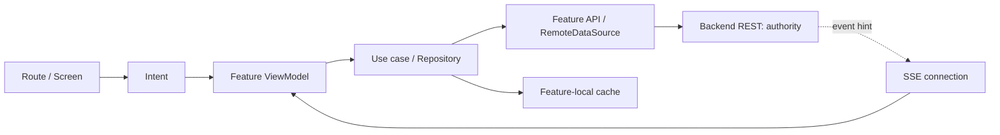

### 2.1 共同规则

- 各 feature 放在 `commonMain/feature/<name>/`，初始结构为 `presentation`、`domain`、`data`、`di`。
- `UiState` 是可渲染、可恢复的状态；`UiEffect` 仅用于导航、Toast、打开系统界面等一次性效果。
- `Route` 负责 ViewModel、导航和系统 UI Result 映射；`Screen`/组件不持有 `NavController`、Repository、ViewModel 或平台对象。
- REST 详情是任务状态权威；SSE 仅传递增量提示。收到事件、断线重连、前后台恢复或版本缺口后重新拉取 REST 快照。
- 用户、租户或会话变化时，以稳定 context key 重建对应 App Shell、导航树、ViewModel、缓存观察和 SSE 运行态；旧请求的迟到结果不得写入新身份。
- 业务规则、审批、缓存策略、重试和文案在 `commonMain`；Android/iOS 仅实现权限、通知、日历、浏览器登录和深链入口等原子能力。

### 2.2 Core 与 feature 的边界

| 位置 | 职责 |
| --- | --- |
| `app/` | 应用启动、根导航、全局 Toast Host、Session Gate、聚合 feature graph。 |
| `core/network` | 唯一 `HttpClient`、认证 Header、Problem JSON 与网络异常归一化。 |
| `core/navigation` | route 类型、深链原始输入与通用解码运行时；不包含业务导航决定。 |
| `core/systemui` | 窗口级系统 UI Gateway、权限/浏览器/系统设置等 typed 请求与结果。 |
| `core/platform` | 日历、通知等跨 feature 的原子平台能力端口与 Android/iOS 实现。 |
| `feature/*` | 用户可见业务状态、业务文案、API DTO/Repository、流程和 feature 内 UI。 |

## 3. 任务状态与接口原则

任务状态以当前可执行契约为准：

```text
QUEUED → GATHERING_CONTEXT → PLANNING → VALIDATING
       → AWAITING_APPROVAL → EXECUTING → COMPLETED

活动状态可按契约转入 RETRYING、FAILED、CANCELLED。
```

App 不推断或本地推进任务状态。它仅提交命令、展示服务器快照，并将后端的结构化错误映射为 UI 状态。

| 接口类别 | 接口 | 状态 |
| --- | --- | --- |
| 健康检查 | `GET /health/live`、`GET /health/ready` | 已有 |
| 创建任务 | `POST /v1/tasks` | 已有骨架 |
| 任务详情 | `GET /v1/tasks/{taskId}` | 已有骨架 |
| 偏好 | `GET/PUT /v1/preferences/me` | 拟新增 |
| 任务列表 | `GET /v1/tasks?status=&cursor=` | 拟新增 |
| 任务事件 | `GET /v1/tasks/{taskId}/events?after=` | 拟新增 |
| 任务事件流 | `GET /v1/tasks/{taskId}/stream` | 拟新增 |
| 审批决定 | `POST /v1/tasks/{taskId}/approvals/{approvalId}/decisions` | 拟新增，需冻结路径 |
| 失败动作重试 | `POST /v1/tasks/{taskId}/actions/{actionId}/retry` | 拟新增 |
| 设备通知注册 | `POST /v1/devices/push-tokens` | 拟新增 |

所有写命令均使用 `Idempotency-Key`。改变既有任务的命令还必须携带 `expectedVersion`；后端返回 `409 TASK_STATE_CONFLICT` 时，App 拉取最新快照并要求用户重新确认。

## 4. MVP 模块

### A0. 应用基础壳（`app`）

**职责**：应用启动、主题与 Compose Resources、根导航、全局 Toast、运行配置、Koin composition root 和 Debug 固定数据入口。

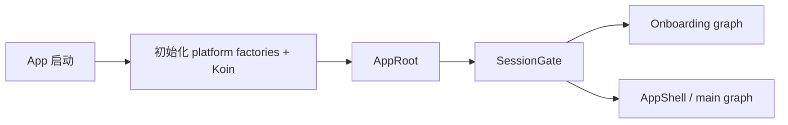

| 项目 | 方案 |
| --- | --- |
| 后端 | 否；仅由 `session` 决定是否需要网络恢复。 |
| 主要类型 | `AppRoot`、`AppShell`、根 `NavHost`、`LocalAppToast`。 |
| 注意事项 | 只在根部放一个 Toast Host；用户可见文案使用 Compose Resources；根导航只聚合 graph，不承载 feature 业务规则。 |
| 独立验收 | Android Debug APK 可启动，在首页、任务、偏好占位页之间导航；中英文资源均能解析。 |

### A1. 会话与启动恢复（`feature/session`）

**职责**：恢复会话、登录/登出、发布当前身份上下文，并在身份改变时销毁失效运行态。

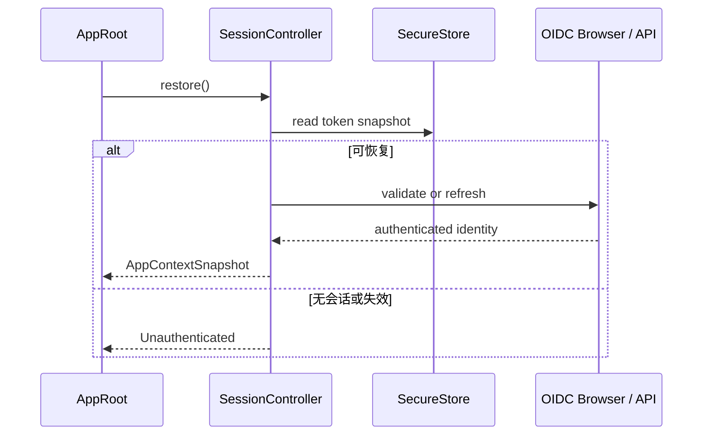

| 项目 | 方案 |
| --- | --- |
| 后端 | 是。OIDC/JWT 鉴权边界；业务接口使用 Bearer Token。 |
| 主要类型 | `SessionController`、`AuthRepository`、`AuthGate`、`AppContextSnapshot`。 |
| 注意事项 | Token 仅存安全平台存储，绝不进入 UI 状态/日志；用户或租户切换时关闭旧 SSE、取消旧请求、失效缓存并用 `key(contextId)` 重建 Shell。 |
| 独立验收 | 无会话进入登录/开发身份入口；登录后进入引导/首页；登出后无法查看旧任务缓存。 |

### A2. 首次引导（`feature/onboarding`）

**职责**：以最小步骤收集兴趣、现实约束和可选授权说明，保存偏好后进入首页。

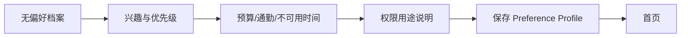

| 项目 | 方案 |
| --- | --- |
| 后端 | 是。拟新增 `GET/PUT /v1/preferences/me`。 |
| 请求重点 | `interests`、`budget`、`maxCommuteMinutes`、`unavailableWindows`、`surpriseFrequency`、`expectedVersion`。 |
| 注意事项 | 不强制日历/通知/位置授权；至少一个兴趣域，预算大于 0，通勤 5–120 分钟；本地草稿与已同步档案分开。 |
| 独立验收 | 无日历权限仍能完成引导；非法输入不能提交；成功保存后首页可读取当前档案。 |

### A3. 偏好与设置（`feature/preferences`）

**职责**：查看和编辑长期偏好、授权状态及其说明。

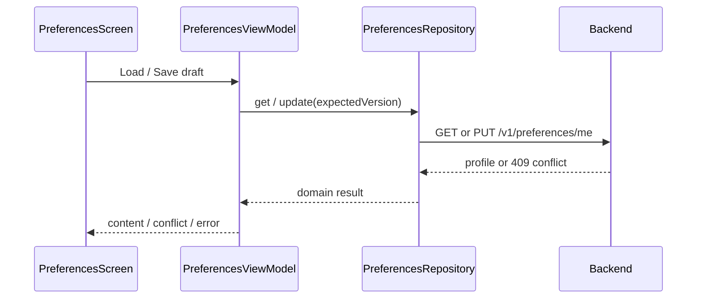

| 项目 | 方案 |
| --- | --- |
| 后端 | 是。复用偏好接口。 |
| 状态 | `Loading`、`Content`、`Saving`、`VersionConflict`、`Error`。 |
| 注意事项 | 任务创建时后端保存快照；偏好修改只影响未来任务。版本冲突需明确展示服务端版本与本地草稿，不能静默覆盖。 |
| 独立验收 | 修改偏好后新任务使用新版本；旧任务显示原快照。 |

### A4. 首页（`feature/home`）

**职责**：展示待审批入口、本周安排、创建任务入口和 MVP 预填充任务卡。

```mermaid
flowchart LR
    Open["打开首页"] --> Cache["读取任务摘要缓存"]
    Cache --> Remote["拉取任务摘要"]
    Remote --> Render["待审批 / 本周 / 创建入口"]
    Render --> Create["打开 TaskCreate"]
    Render --> Detail["打开 TaskDetail(taskId)"]
```

| 项目 | 方案 |
| --- | --- |
| 后端 | 是。拟新增 `GET /v1/tasks?status=&cursor=`。 |
| 状态 | 首屏 Loading、缓存内容校验、空态、刷新失败、离线内容。 |
| 注意事项 | 首页不自动创建任务；MVP 的“发现”仅为预填充创建卡，不包含主动机会流。 |
| 独立验收 | 有待审批时显示横幅；无任务时显示首个计划 CTA；刷新失败保留已有内容。 |

### A5. 创建任务（`feature/task-create`）

**职责**：收集自然语言请求、默认时间范围和快捷条件，创建幂等任务并跳转详情。

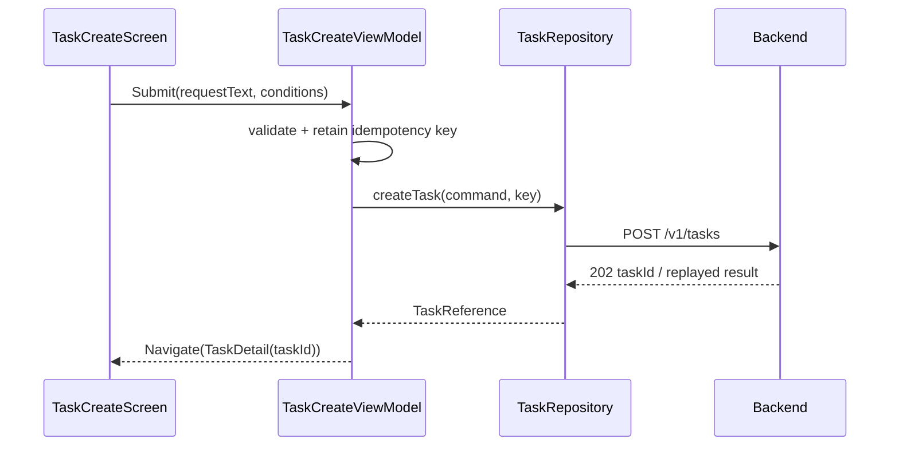

| 项目 | 方案 |
| --- | --- |
| 后端 | 是。现有 `POST /v1/tasks` 扩展为包含 `timeRange`、`constraints` 与偏好快照语义。 |
| 失败 | 空文本为本地错误；网络超时允许重试同一 key；`409 IDEMPOTENCY_CONFLICT` 显示不可重放错误。 |
| 注意事项 | `202 Accepted` 只表示任务已接收，不表示计划已经生成；提交时禁用按钮，直到获得明确结果。 |
| 独立验收 | 连续点击与网络重放只创建一个任务，且立即获得 task ID。 |

### A6. 任务中心（`feature/task-list`）

**职责**：按待处理、进行中、已完成分组展示任务，并支持缓存恢复和刷新。

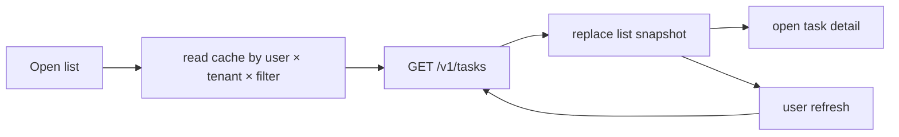

| 项目 | 方案 |
| --- | --- |
| 后端 | 是。拟新增任务列表接口，支持 cursor 后再增加分页。 |
| 本地数据 | `LocalDataSource` 只存 feature 私有 DTO 快照；Repository 负责 DTO ↔ domain 与缓存/远端协调。 |
| 注意事项 | `ContextIdentity × DataKey` 包含 user、tenant、状态筛选；无身份不读写。首版无 cursor 合同时不伪造分页。 |
| 独立验收 | 冷启动先展示最近缓存，再由服务端覆盖；用户切换后不会读到旧用户任务。 |

### A7. 任务详情与状态订阅（`feature/task-detail`）

**职责**：以单个任务快照为中心，展示阶段、下一步、计划、审批和最终结果；管理该任务的 SSE 生命周期。

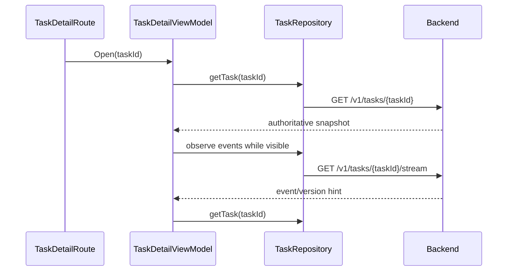

| 项目 | 方案 |
| --- | --- |
| 后端 | 是。复用现有详情；拟新增 stream 或 cursor events。 |
| 状态 | `Loading`、`Planning(step)`、`AwaitingApproval`、`Completed`、`Failed(retryable)`、`Offline(snapshot)`。 |
| 注意事项 | ViewModel 只在任务详情可见、身份有效时订阅；离开页面/身份变化/后台策略关闭连接。SSE 事件不能直接改写完整 UI。 |
| 独立验收 | 任务从规划转待审批后，页面在收到提示并刷新快照后更新；断线后恢复到正确快照。 |

### A8. 方案比较与重新生成（`feature/plan-comparison`）

**职责**：比较 Plan A/B/C，展示理由、来源、时效、预算、通勤和待执行动作；按明确方向创建新任务。

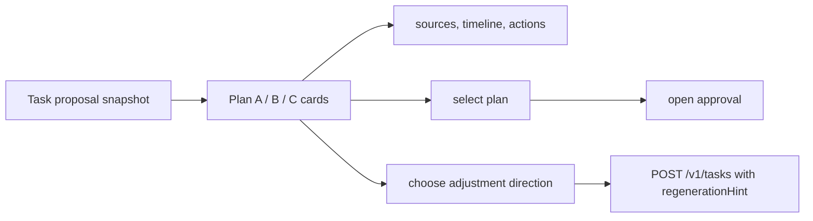

| 项目 | 方案 |
| --- | --- |
| 后端 | 读取复用任务详情；重新生成复用创建任务接口，拟新增 `regenerationHint` 与 `parentTaskId`。 |
| 注意事项 | 不展示抽象模型分数；惊喜方案显式标为新体验；过期、冲突或超预算方案不可审批。 |
| 独立验收 | 用户一屏区分方案取舍；重新生成后得到新的 task ID，旧任务和时间线不变。 |

### A9. 审批（`feature/approval`）

**职责**：展示审批快照与副作用，编辑允许字段，并提交批准、拒绝或稍后处理。

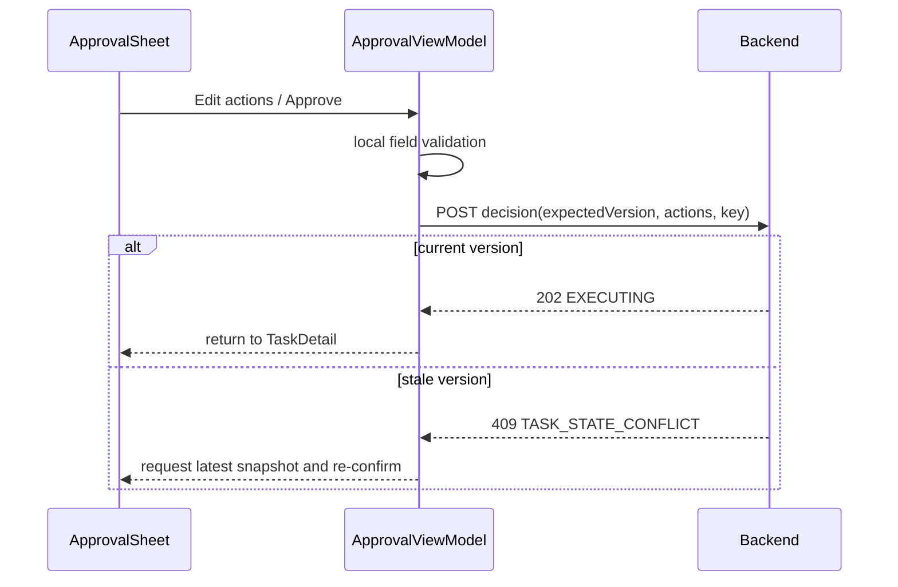

| 项目 | 方案 |
| --- | --- |
| 后端 | 是。拟新增 `POST /v1/tasks/{taskId}/approvals/{approvalId}/decisions`。 |
| 请求重点 | `expectedVersion`、动作开关、标题/时间/提醒编辑值、决定类型；Header `Idempotency-Key`。 |
| 注意事项 | 后端原子校验 owner、tenant、审批版本、状态、Schema、权限和数据时效；至少一个动作启用才允许批准。用户编辑不会让 AI 重写旧计划。 |
| 独立验收 | 未批准前没有写操作；并发或重复批准只产生一次执行；版本过期要求重新确认。 |

### A10. 执行结果与失败动作重试（`feature/execution-result`）

**职责**：展示日历、提醒等动作的成功、部分成功或失败；只重试失败动作。

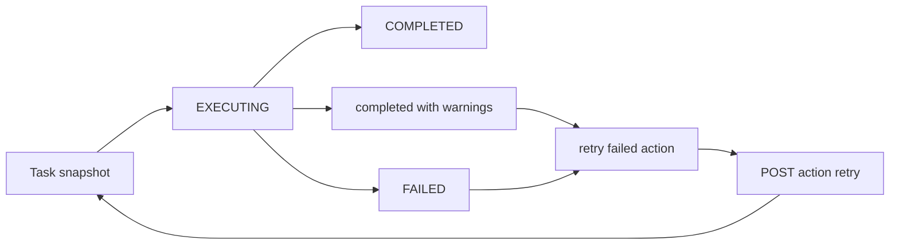

| 项目 | 方案 |
| --- | --- |
| 后端 | 是。拟新增动作重试接口及动作级结果字段。 |
| 注意事项 | 部分成功是展示结果，不能伪装成全部成功；重试复用服务端动作幂等键，已成功动作不重新写入。未知外部结果先对账，不能盲目重试。 |
| 独立验收 | 日历成功、提醒失败时清楚展示两项结果；重试后只调用失败动作一次。 |

### A11. 任务时间线（`feature/timeline`）

**职责**：按时间展示创建、规划、插件、校验、审批、执行、重试和失败的不可变摘要事件。

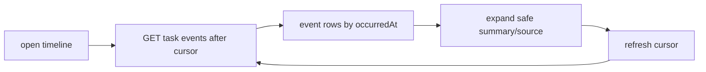

| 项目 | 方案 |
| --- | --- |
| 后端 | 是。拟新增 `GET /v1/tasks/{taskId}/events?after=`。 |
| 注意事项 | 时间线是任务状态的审计投影，不替代任务详情；仅显示脱敏摘要，禁止泄露模型 Prompt、Token、密钥或完整敏感上下文。 |
| 独立验收 | 创建、候选、审批和执行后均能看到对应事件；事件顺序稳定且不泄露敏感字段。 |

### A12. 任务缓存与恢复（`feature/task-sync`）

**职责**：为首页、任务列表与详情提供本地恢复快照和断网后的安全同步策略。

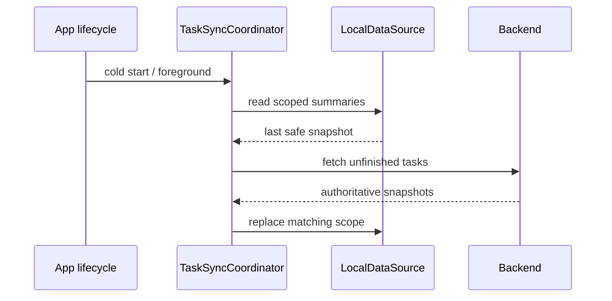

| 项目 | 方案 |
| --- | --- |
| 后端 | 是。依赖任务列表、详情和事件接口。 |
| 本地数据 | 只缓存任务摘要与必要详情快照，按 `user × tenant × task/list key` 隔离并版本化。 |
| 注意事项 | 缓存不发起审批或副作用；离线时可浏览缓存和编辑草稿，但“生成计划”和“批准并安排”按产品策略禁用或进入明确的离线队列。 |
| 独立验收 | 冷启动显示缓存后被服务端覆盖；身份切换与迟到响应均不串写。 |

### A13. 权限（`feature/permissions`）

**职责**：以明确用途解释日历、通知和位置权限，调用系统 UI 并把结构化结果返回业务页面。

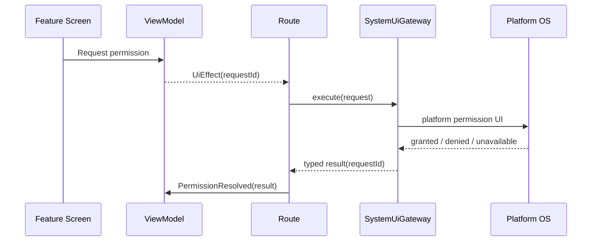

| 项目 | 方案 |
| --- | --- |
| 后端 | 可选。偏好接口只保存产品内说明状态或授权需求，不保存系统权限本身。 |
| 注意事项 | ViewModel 不持有 `Activity`/`UIViewController`；取消、宿主销毁、平台不支持和迟到回调都用同一 `requestId` 收敛。无日历权限仍允许规划，但必须标记未校验忙碌时间。 |
| 独立验收 | Android/iOS 均能区分授权、拒绝、取消和不可用；拒绝后业务状态不悬挂。 |

### A14. 通知与深链（`feature/notifications`、`feature/deep-link`）

**职责**：注册设备通知能力，接收待审批提醒，并通过 `taskId` 进入由服务端状态决定的详情页。

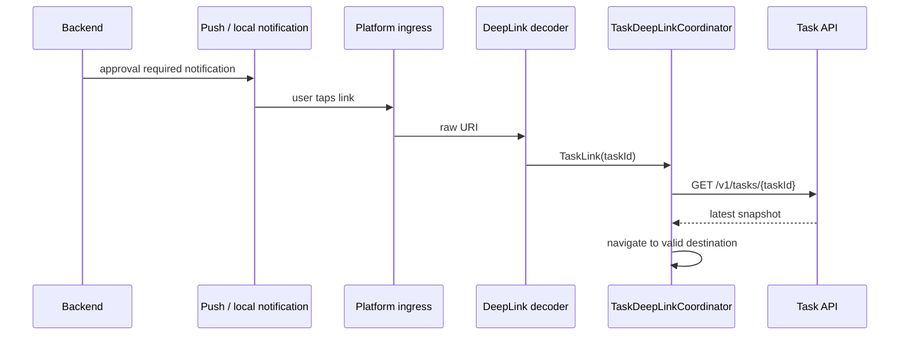

| 项目 | 方案 |
| --- | --- |
| 后端 | 是。拟新增 `POST /v1/devices/push-tokens`；通知由后端基于任务状态产生。 |
| 注意事项 | 深链只携带稳定 ID，不携带审批 payload；平台入口不解析业务路径、不直接导航、不记录原始 URI。任务已处理时显示最终结果，不显示过期审批。 |
| 独立验收 | 点击待审批通知打开对应任务；同一状态不重复通知；赛前提醒只在审批动作成功后存在。 |

## 5. P1 模块（不纳入 MVP 验收）

### P1-A. 聊天与本次条件（`feature/chat`）

**职责**：把用户当前对话变成可见、可编辑、可删除的本次条件；最终由 `task-create` 固化为任务。

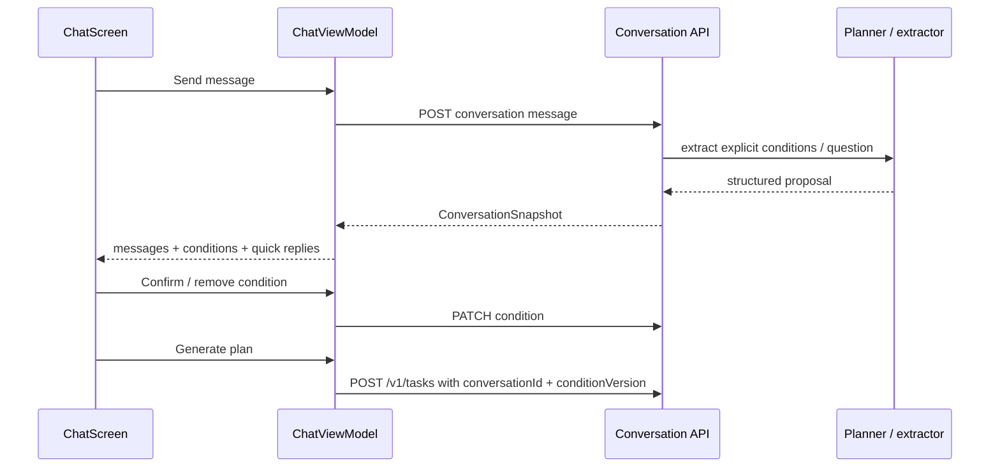

| 项目 | 方案 |
| --- | --- |
| 后端 | 是。拟新增 `POST/GET /v1/conversations`、`POST /v1/conversations/{id}/messages`、`PATCH /v1/conversations/{id}/conditions/{conditionId}`。 |
| 注意事项 | 长期偏好仅作为“可采纳建议”；聊天不静默带入固定预算或时间。AI 只提取结构化条件、追问和提议，不能创建任务或写入偏好。 |
| 独立验收 | 两次新聊天不共享本次条件；删除/清空条件后重新计算可生成门槛。 |

### P1-B. 主动机会（`feature/discovery`）

**职责**：展示少量有来源、时效和推荐理由的高质量机会，并让用户围绕机会开始聊天或给出负反馈。

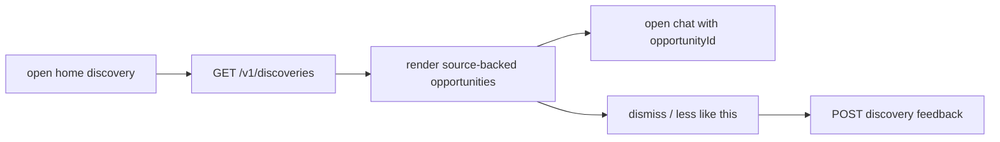

| 项目 | 方案 |
| --- | --- |
| 后端 | 是。拟新增 `GET /v1/discoveries`、`POST /v1/discoveries/{id}/dismiss`。 |
| 注意事项 | 每日邀约最多一条；无高质量机会显示空态；机会不会自动创建任务、审批或副作用。 |
| 独立验收 | 点击机会带上下文进入聊天；负反馈立即从当前列表隐藏，并影响后续排序。 |

### P1-C. 结果反馈与画像洞察（`feature/feedback`、`feature/profile-insights`）

**职责**：收集结果反馈，展示有证据的长期偏好建议，并让用户决定是否保存或删除。

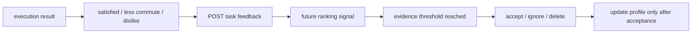

| 项目 | 方案 |
| --- | --- |
| 后端 | 是。拟新增 `POST /v1/tasks/{taskId}/feedback`、`GET /v1/profile/insights`、`POST/DELETE` 洞察决定接口。 |
| 注意事项 | 单次反馈只作为排序信号；推断必须展示证据；用户删除洞察后，后续排序不再使用该信号。 |
| 独立验收 | 反馈后显示已记录；删除洞察后，新任务的理由不再引用该信号。 |

## 6. 后端、AI 与平台责任

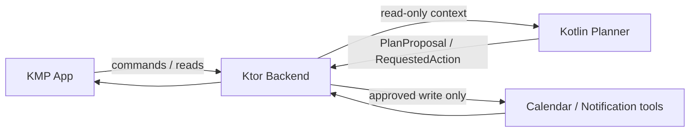

| 层 | 必须负责 | 禁止负责 |
| --- | --- | --- |
| App | 交互、可恢复展示、本地草稿/缓存、系统能力请求、将用户决定提交后端。 | 本地推进权威任务状态、绕过审批执行写操作、直接持有第三方凭据。 |
| Backend | 鉴权、任务状态机、审批版本、幂等、审计、Outbox、Worker 和工具执行。 | 让模型直接写日历、通知或数据库。 |
| AI | 结构化条件提取、PlanProposal、理由、风险标签、确定性策略前后的受限建议。 | 读取凭据、拥有任务状态、调用写工具、生成动作幂等键。 |
| Platform adapter | 权限、通知、日历、浏览器和深链的原子系统操作。 | 业务状态机、规划、审批策略、缓存/重试策略和用户文案。 |

## 7. 推荐实施切片

| 阶段 | 用户可见成果 | 涉及模块 | 最小验证 |
| --- | --- | --- | --- |
| F0 | 可启动、可导航的 App 壳 | A0、A1 开发身份 | Debug APK 启动；根导航与资源验证。 |
| F1 | 固定数据的创建任务与详情演示 | A4、A5、A7、A8 | 创建后进入详情；Loading/空态/失败态均可演示。 |
| F2 | 接入后端任务创建与规划状态 | A5、A7、A11 | 202、幂等重放、详情刷新和状态迁移测试。 |
| F3 | 个性化计划 | A2、A3、A6、A8 | 偏好版本/快照、约束校验、缓存隔离测试。 |
| F4 | 可控副作用闭环 | A9、A10、A11 | 审批版本、动作幂等、部分失败和重试测试。 |
| F5 | 恢复与平台能力 | A12、A13、A14 | 冷启动恢复、离线提示、通知深链、权限拒绝测试。 |
| P1 | 对话、发现、反馈学习 | P1-A、P1-B、P1-C | 会话条件隔离、机会负反馈、洞察证据验证。 |

## 8. 需先冻结的决策

1. **审批 API 路径**：本文建议使用嵌套路径 `POST /v1/tasks/{taskId}/approvals/{approvalId}/decisions`；现有文档中的另一种审批路径应在实现前删除或迁移，避免客户端与后端各自选择。
2. **执行中取消**：当前可执行状态机没有 `EXECUTING → CANCELLED`。产品若要求执行中取消，必须先定义在途外部动作、补偿和用户可见语义，再同步更新 contracts、测试和文档。
3. **离线命令策略**：MVP 是禁用“生成计划”和“批准并安排”，还是持久化本地命令队列后重放，需在 F5 前确认；前者是首版推荐的最小方案。
4. **聊天持久化范围**：P1 应将聊天作为服务端持久化 conversation，还是仅作为创建任务前的短草稿；为了断线恢复与多入口复用，本文建议采用前者。

## 9. 重新评估条件

当 iOS 进入正式发布、真实 Calendar/Notification 连接器替代 Fake、SSE 引入或聊天提前进入 MVP 时，重新检查平台能力、缓存/上下文生命周期、接口兼容性、状态机和测试范围。
